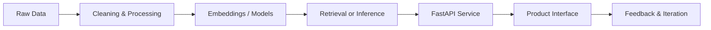

<div align="center">


<p>
  <a href="mailto:joyjonesmark@gmail.com"></a>
  <a href="https://linkedin.com/in/joyjonesmark"></a>
  <a href="https://github.com/joyjonesmark"></a>
</p>

<p>
  
</p>

</div>

---

## About

I build AI systems that move beyond notebooks: retrieval pipelines, computer vision workflows, ML-backed APIs, and full-stack applications that can be tested, deployed, and improved.

My work sits at the intersection of **machine learning**, **backend engineering**, and **product-minded AI development**. I care about clean data flow, useful abstractions, reliable inference, and systems that are understandable after the demo is over.

```txt
Focus        : Applied ML, Generative AI, Computer Vision, RAG, MLOps
Core stack   : Python, FastAPI, TensorFlow/Keras, OpenCV, SQL, Docker
Learning     : Agentic systems, evaluation pipelines, scalable AI backends
Location     : Chennai, India
```

---

## Engineering Direction

<table>
<tr>
<td width="33%" valign="top">

### Intelligence Layer

Designing ML and LLM workflows that can reason over data, documents, images, and structured context.

</td>
<td width="33%" valign="top">

### Application Layer

Building clean APIs, user-facing tools, and backend services around AI capabilities.

</td>
<td width="33%" valign="top">

### Systems Layer

Thinking about deployment, observability, caching, storage, and reliable model-serving patterns.

</td>
</tr>
</table>

---

## Technical Stack

<div align="center">

### AI / Machine Learning


<br />


### Backend / Infrastructure


<br />


### Frontend / Databases


<br />


</div>

---

## What I Like Building



I’m most interested in systems where AI is part of a real workflow:

- document intelligence and semantic retrieval
- image understanding and visual search
- model-backed APIs for practical applications
- data pipelines that turn messy inputs into useful signals
- AI tools that are simple enough for people to actually use

---

## Current Operating System

<table>
<tr>
<td width="50%" valign="top">

### Building

- Production-style AI backends
- RAG and multi-document reasoning systems
- Computer vision workflows
- Data products with practical ML integration

</td>
<td width="50%" valign="top">

### Improving

- Evaluation for LLM applications
- Deployment patterns for ML services
- SQL, analytics, and statistical thinking
- Cleaner architecture for full-stack AI apps

</td>
</tr>
</table>

---

## GitHub Signal

<div align="center">


</div>

---

## Contribution Map

<div align="center">


</div>

---

## Contact

<div align="center">

Open to conversations around **AI engineering**, **ML applications**, **data systems**, and **full-stack AI products**.

<br />

<a href="mailto:joyjonesmark@gmail.com"></a>
<a href="https://linkedin.com/in/joyjonesmark"></a>
<a href="https://github.com/joyjonesmark"></a>

</div>

<br />

<div align="center">


</div>
